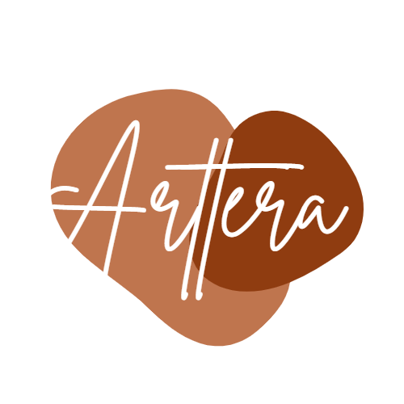

# 🎨 ArtTera Shop - E-Commerce Platform


<p align="center">
  
</p>

**ArtTera Shop** adalah aplikasi web e-commerce yang dirancang untuk memasarkan berbagai produk kreatif, mulai dari fashion (sepatu, jaket) hingga karya seni (lukisan). Aplikasi ini menyediakan pengalaman belanja yang mulus bagi pelanggan dan panel admin yang canggih untuk pengelolaan toko.

---

## ✨ Fitur Utama

### 🛍️ Sisi Pelanggan (Front-End)
- **Halaman Utama & Galeri:** Menampilkan etalase produk yang menarik.
- **Pencarian Produk:** Fitur pencarian untuk menemukan barang dengan cepat.
- **Keranjang Belanja (Cart):** Manajemen item sebelum checkout.
- **Checkout & Pesanan:** Proses pembelian dan riwayat pemesanan (`Orders`).
- **Profil Pengguna:** Kelola informasi profil dan alamat pengiriman.
- **Halaman Statis:** About Us, Contact, dan Gallery.

### ⚙️ Panel Admin (Filament)
- **Dashboard Statistik:** Ringkasan performa toko.
- **Manajemen Produk:** Tambah, edit, dan hapus produk (termasuk upload gambar).
- **Manajemen Pesanan:** Pantau status pesanan pelanggan.
- **Autentikasi:** Login aman untuk admin dan pengguna.

---

## 🛠️ Teknologi yang Digunakan

- **Backend:** Laravel Framework
- **Admin Panel:** FilamentPHP
- **Frontend:** Blade Templates, Tailwind CSS
- **Database:** MySQL
- **Assets:** Vite

## 🚀 Instalasi & Konfigurasi

Ikuti langkah-langkah berikut untuk menjalankan proyek di komputer lokal:

### 1. Clone Repositori
```bash
git clone [https://github.com/TeguhAldianto/ArtTera-shop.git](https://github.com/TeguhAldianto/ArtTera-shop.git)
cd ArtTera-shop

```

### 2. Install Dependencies

```bash
composer install
npm install

```

### 3. Konfigurasi Environment

Salin file konfigurasi dan sesuaikan dengan database lokal Anda:

```bash
cp .env.example .env

```

Buka file `.env` dan atur database:

```env
DB_CONNECTION=mysql
DB_HOST=127.0.0.1
DB_PORT=3306
DB_DATABASE=arttera_db
DB_USERNAME=root
DB_PASSWORD=

```

### 4. Generate Key & Storage Link

```bash
php artisan key:generate
php artisan storage:link

```

### 5. Migrasi Database & Seeder

```bash
php artisan migrate --seed

```

*(Opsional: Jika ada data dummy di seeder, ini akan memasukkannya ke database)*

### 6. Jalankan Aplikasi

Jalankan server Laravel dan Vite secara bersamaan (jika perlu):

```bash
npm run dev
php artisan serve

```

Akses aplikasi di: `http://localhost:8000`
Akses admin panel di: `http://localhost:8000/admin` (atau `/filamen` tergantung konfigurasi).

---

## 📂 Struktur Folder Penting

* `app/Filament/` - Logika Panel Admin (Resource Produk & Order).
* `resources/views/` - Tampilan antarmuka pengguna (Blade).
* `public/uploaded_img/` - Penyimpanan gambar produk yang diunggah.
* `public/images/` - Aset statis situs (Logo, Banner).

---

## 👨‍💻 Author

**Teguh Aldianto**

* 📧 Email: [aldinamanya08@gmail.com](mailto:aldinamanya08@gmail.com)
* 💼 LinkedIn: [Teguh Aldianto](https://www.linkedin.com/in/teguh-aldianto-705653298)

---

## 📄 Lisensi

Proyek ini bersifat open-source dan tersedia di bawah lisensi [MIT](https://opensource.org/licenses/MIT).
